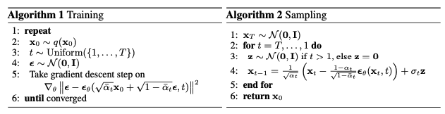
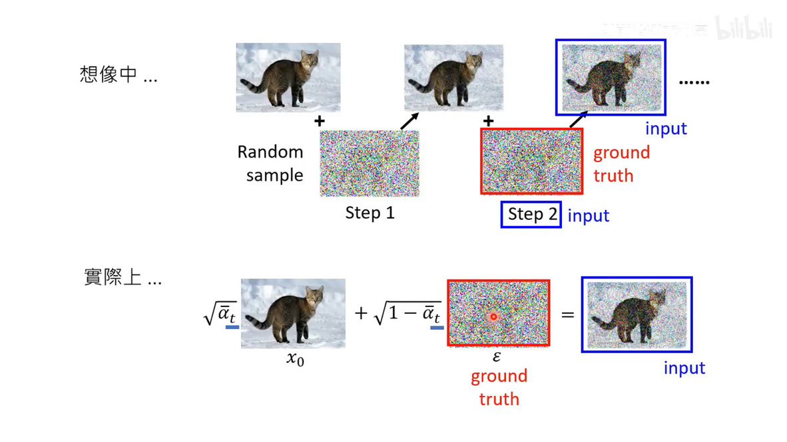

##### DDPM

* 知识点

  * DDPM：可用于图像生成、图像超分辨率

    * 训练过程，随机生成高斯噪声，噪声与原图加权相加得到带噪声图片，带噪声图片与噪声程度 t（用于计算时间嵌入）输入到噪声预测器（UNet），输出预测的噪声，预测的噪声与生成的高斯噪声计算 MSE 损失
    * 推理过程，随机生成高斯噪声作为第 T=1000 步的噪声图片，迭代 t=(1000→0) 去噪得到生成的图片，去噪过程是，给定带噪声的图片 $x_t$，预测第 t 步添加的噪声 noise，$x_t$ 减去 noise 得到前一步的噪声图片 $x_{t-1}$
    * 图像生成就是训练一个模型，将一个简单分布映射为真实数据的分布，从而将简单分布中的向量变成真实数据，在 DDPM 中是将一张随机生成的高斯噪声变成图像，噪声是随机的所以生成的图像也是数据集中没有的
    * ​​
    * ​​
  * 推理阶段也要经过 1000 次去噪过程，推理速度还是挺慢的
  * 条件生成就是像时间嵌入一样，给噪声预测器多加一个输入，图片类别标签，使其预测时间 t，类别 c 时施加的噪声
* 代码运行

  * 环境配置：`city945/pytorch:1.11.0-cuda11.3-cudnn8-devel`​
* 代码阅读

  * 代码执行图

    * ​`python Main.py`​/`train`​

      * ​`GaussianDiffusionTrainer.forward`​

        * ```python
          """
          t: (B,) 总步数 T=1000，t 的取值为 1000 内的随机正整数
          noise: (B, C, H, W) torch.randn 生成的标准正态分布噪声
          x_t: 对应公式 1，计算噪声预测器输入，
              extract: 输入 v (1000,) 为权重系数表，t 随机整数下标，输出 (B,1,1,1) 权重系数
          UNet.forward: 输入 x_t 为带噪声图片输入，输出预测的第 t 步添加的噪声
          Args:
              x_0: (B, C, H, W)
          """
          torch.gather(v, index=t, dim=0) # 从 v 中取下标为 t 的元素
          ```
          * 公式 1：$x_t = \sqrt{\bar\alpha} x_0 + \sqrt{1 - \bar\alpha}\epsilon$，$\bar\alpha$ 为 从 1 到 0 递减的权重系数
        * ​`UNet.forward`​

          * ```bash
            # t: (B,) 随机整数，TimeEmbedding 输出 (B,C=512) 时间嵌入向量
            temb = self.time_embedding(t)
            # 修改 ResBlock，将时间嵌入向量用普通加法加到中间特征中
            h += self.temb_proj(temb)[:, :, None, None]
            ```
    * ​`python Main.py`​/`eval`​

      * ​`GaussianDiffusionSampler.forward`​

        * ```python
          """
          T 逆序逐步去噪得到生成的图片
          p_mean_variance: 计算 x_{t-1} 
              xt_prev_mean: 对应公式 2，前一步带噪声的图片
          Args:
              x_T: (B,C,H,W) 随机生成的正态分布噪声图片作为前向扩散中的最后一步噪声图片
          Returns:
              x_0: 生成的图片
          """
          mean, var= self.p_mean_variance(x_t=x_t, t=t)
          x_t = mean + torch.sqrt(var) * noise # 这里确实不知何故要再加一个噪声
          ```
          * 公式 2：$meanx_{t-1} = \frac{1}{\sqrt{\bar\alpha}}(x_t - \frac{1-\alpha}{\sqrt{1-\bar\alpha}}\epsilon(x_t, t))$
    * ​`python MainCondition.py`​/`train`​

      * 同无条件生成，只对 UNet 部分多增加一个图片类别标签输入，与时间嵌入类似
      * ​`UNet.forward`​

        * ```bash
          temb = self.time_embedding(t)
          cemb = self.cond_embedding(labels)
          h += self.temb_proj(temb)[:, :, None, None]
          h += self.cond_proj(labels)[:, :, None, None]
          ```
    * ​`python MainCondition.py`​/`eval`​

      * ```bash
        bs=80，labels=[0*8,...9*8]，每行 8 个同类别
        ```
      * ​`GaussianDiffusionSampler`​在噪声预测器的输入加入类别标签，预测步数 t，类别 c 时加入的噪声
